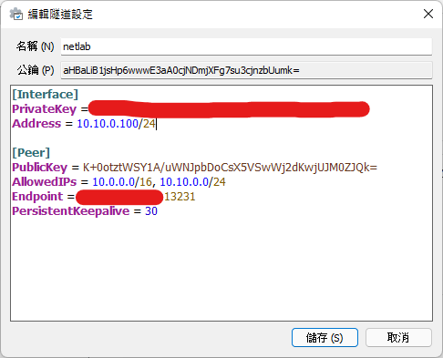
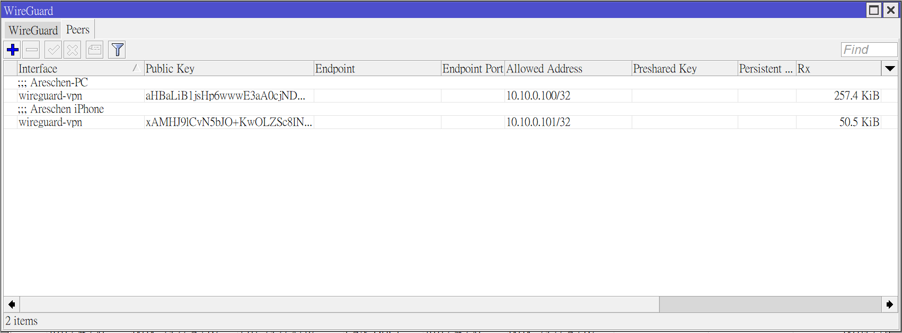

# 前言廢話
WireGuard的優點、與其他VPN方案的比較以及如何設定WireGuard這篇並不會詳細介紹，之後會再另外寫一篇來跟大家分享。

這篇文章主要會分享我最近因為在VMWare ESXi上架設了kubernetes的練習環境，開了8台虛擬機來做高可用性備援的設定練習，為了方便操作NAT後面的這些機器所以想要架設VPN。

在ESXi內的路由我原本是使用RouterOS 6.49.2版本的虛擬機來實現，最近因為喜歡看[Zac Guo](https://www.youtube.com/c/ZacGuo)講解網路的影片，注意到WireGuard這個優秀的VPN方案。然而只有RouterOS 7版以上才直接內建支援WireGuard，所以愛嘗鮮的我當然就直接拋棄使用以往的L2TP/IPSec或OpenVPN，直接將RouterOS升級至7.1.1版本奔向WireGuard的懷抱中。但在設定完的時候碰到了一個小問題，以下就來記錄一下，我到底犯了甚麼蠢。

# 問題
一開始設定完的時候非常順利，我的電腦可以直接正常訪問NAT後面的虛擬機器。但在一個我睡不著的日子裡，我想說試試看在我的手機上設定WireGuard，不設定還沒事，一設定下去我更難受了，直接失眠到天亮。我發現設定完之後，手機雖然正常通了，可以正常訪問NAT後面的機器們，但我想說嘗試Ping看看我的電腦，想知道客戶端之間可不可以互聯。我用手機Ping了我的電腦發現不會通，我想說應該可能只是路由沒有設定好還是怎麼樣的，但是當我用電腦要連線NAT後面的機器的時候，發現見鬼了，我的電腦竟然不通了。於是我先到RouterOS中WireGuard的Peer設定先把我的手機和電腦從中移除，然後先只加入電腦，再用電腦測試，就恢復正常了。在我想說可能是連線重置失敗卡住之類的問題時，我將手機再加回Peer內，用手機Ping了NAT後面的機器，這下可好了，換手機不通... 現在變成要嘛是我的手機會通，要嘛是我的電腦會通，就是不會兩個一起通，真是無語。

我就覺得很奇怪，以下是我當初的設定:

> 上圖是RouterOS解決前的設定

> 上圖是PC客戶端解決前的設定

> 上圖是iOS客戶端解決前的設定

其實會設定的人看到上面幾張圖就知道我到底設定錯了什麼，希望能搏君一笑，可以前方交流道右轉離開了。

# 解決
經過了一番Google和排錯後，現在來公布解答。

原因出在RouterOS的設定上，在WireGuard的設定中，每個Peer都有AllowedIPs的設定，起初我以為這個設定只是設定允許那些網段可以放行到那些Peer去。殊不知坑就在這裡，原來WireGuard的AllowedIPs還會用來讓Interface決定收到的請求要使用哪個Peer的公私鑰處理並送出，所以也有決定路由的成分。

以原本的設定來說，因為兩個Peer的AllowedIPs都是設定為10.10.0.0/24，所以WireGuard就會先看哪一個Peer先建立連接，之後所有的10.10.0.0/24的請求都只會從那個Peer出去。也因為這樣，自然其他的Peer就都收不到封包，也就無法順利通訊。

解決方法就是將Peer的AllowedIPs都改成對應ClientIP/32的範圍，因為對端裝置不是路由器，所以使用點到點即可，這樣Interface收到請求後就會正確的分別轉送到正確的Peer去。

到這裡，手機跟電腦終於都可以順利的同時訪問NAT後面的機器了。

> 上圖是RouterOS解決後的設定

完